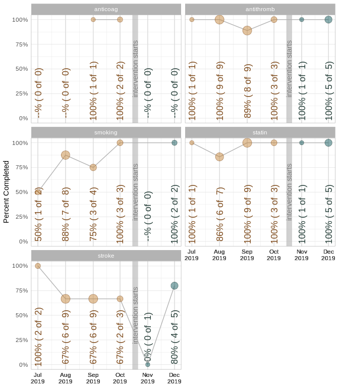

This report covers the analyses used in the ZZZ project (Marcus Mark, PI).

<!--  Set the working directory to the repository's base directory; this assumes the report is nested inside of two directories.-->


<!-- Set the report-wide options, and point to the external code file. -->


<!-- Load 'sourced' R files.  Suppress the output when loading sources. -->


<!-- Load packages, or at least verify they're available on the local machine.  Suppress the output when loading packages. -->


<!-- Load any global functions and variables declared in the R file.  Suppress the output. -->


<!-- Declare any global functions specific to a Rmd output.  Suppress the output. -->


<!-- Load the datasets.   -->


<!-- Tweak the datasets.   -->


Summary {.tabset .tabset-fade .tabset-pills}
===========================================================================

Notes
---------------------------------------------------------------------------

1. The current report covers 36 month, with 2 unique values for `month`.


Unanswered Questions
---------------------------------------------------------------------------


Answered Questions
---------------------------------------------------------------------------


Graphs
===========================================================================


Marginals
---------------------------------------------------------------------------


Scatterplots
---------------------------------------------------------------------------

<!-- -->


Models
===========================================================================

Model Exploration
---------------------------------------------------------------------------

```


 Model proportion w/ Gaussian link
```

```

Call:
lm(formula = proportion ~ 1 + post, data = ds_model, subset = (metric != 
    "cumulative"))

Residuals:
     Min       1Q   Median       3Q      Max 
-0.82857 -0.02857  0.11828  0.11828  0.17143 

Coefficients:
            Estimate Std. Error t value Pr(>|t|)
(Intercept)  0.88172    0.05553  15.878 6.91e-14
post        -0.05315    0.10495  -0.506    0.617

Residual standard error: 0.2356 on 23 degrees of freedom
Multiple R-squared:  0.01103,	Adjusted R-squared:  -0.03197 
F-statistic: 0.2565 on 1 and 23 DF,  p-value: 0.6173
```

```


 Model logit w/ Gaussian link
```

```

Call:
lm(formula = logit ~ 1 + post, data = ds_model, subset = (metric != 
    "cumulative"))

Residuals:
    Min      1Q  Median      3Q     Max 
-3.9261 -0.2373  0.4174  0.6790  1.0155 

Coefficients:
            Estimate Std. Error t value Pr(>|t|)
(Intercept)   1.8852     0.2767   6.814 5.99e-07
post         -0.2617     0.5228  -0.500    0.621

Residual standard error: 1.174 on 23 degrees of freedom
Multiple R-squared:  0.01077,	Adjusted R-squared:  -0.03224 
F-statistic: 0.2505 on 1 and 23 DF,  p-value: 0.6215
```

```


 Model numerator & denominator w/ Poisson link
```

```

Call:
glm(formula = numerator/denominator ~ 1 + post, family = quasipoisson, 
    data = ds_model, subset = (metric != "cumulative"))

Deviance Residuals: 
     Min        1Q    Median        3Q       Max  
-1.28730  -0.03157   0.12329   0.12329   0.18234  

Coefficients:
            Estimate Std. Error t value Pr(>|t|)
(Intercept) -0.12588    0.06429  -1.958   0.0625
post        -0.06218    0.12427  -0.500   0.6216

(Dispersion parameter for quasipoisson family taken to be 0.06559416)

    Null deviance: 2.3827  on 24  degrees of freedom
Residual deviance: 2.3661  on 23  degrees of freedom
AIC: NA

Number of Fisher Scoring iterations: 4
```


Final Model
---------------------------------------------------------------------------


|            | Estimate| Std. Error| t value| Pr(>&#124;t&#124;)|
|:-----------|--------:|----------:|-------:|------------------:|
|(Intercept) |    -0.13|       0.06|   -1.96|               0.06|
|post        |    -0.06|       0.12|   -0.50|               0.62|

In the model that includes two predictors, the slope coefficent of `Miles per gallon` is -0.062176.


Session Information {#session-info}
===========================================================================

For the sake of documentation and reproducibility, the current report was rendered in the following environment.  Click the line below to expand.

<details>
  <summary>Environment <span class="glyphicon glyphicon-plus-sign"></span></summary>

```
─ Session info ───────────────────────────────────────────────────────────────
 setting  value                       
 version  R version 3.6.2 (2019-12-12)
 os       Ubuntu 19.10                
 system   x86_64, linux-gnu           
 ui       X11                         
 language (EN)                        
 collate  en_US.UTF-8                 
 ctype    en_US.UTF-8                 
 tz       America/Chicago             
 date     2020-02-29                  

─ Packages ───────────────────────────────────────────────────────────────────
 package     * version  date       lib source        
 assertthat    0.2.1    2019-03-21 [1] CRAN (R 3.6.1)
 backports     1.1.5    2019-10-02 [1] CRAN (R 3.6.1)
 boot          1.3-24   2019-12-20 [4] CRAN (R 3.6.2)
 callr         3.4.2    2020-02-12 [1] CRAN (R 3.6.2)
 cli           2.0.1    2020-01-08 [1] CRAN (R 3.6.1)
 colorspace    1.4-1    2019-03-18 [1] CRAN (R 3.6.1)
 config        0.3      2018-03-27 [1] CRAN (R 3.6.1)
 crayon        1.3.4    2017-09-16 [1] CRAN (R 3.6.1)
 desc          1.2.0    2018-05-01 [1] CRAN (R 3.6.1)
 devtools      2.2.2    2020-02-17 [1] CRAN (R 3.6.2)
 digest        0.6.24   2020-02-12 [1] CRAN (R 3.6.2)
 dplyr         0.8.4    2020-01-31 [1] CRAN (R 3.6.2)
 ellipsis      0.3.0    2019-09-20 [1] CRAN (R 3.6.1)
 evaluate      0.14     2019-05-28 [1] CRAN (R 3.6.1)
 fansi         0.4.1    2020-01-08 [1] CRAN (R 3.6.1)
 farver        2.0.3    2020-01-16 [1] CRAN (R 3.6.1)
 fs            1.3.1    2019-05-06 [1] CRAN (R 3.6.1)
 ggplot2     * 3.2.1    2019-08-10 [1] CRAN (R 3.6.1)
 glue          1.3.1    2019-03-12 [1] CRAN (R 3.6.1)
 gtable        0.3.0    2019-03-25 [1] CRAN (R 3.6.1)
 highr         0.8      2019-03-20 [1] CRAN (R 3.6.1)
 hms           0.5.3    2020-01-08 [1] CRAN (R 3.6.1)
 htmltools     0.4.0    2019-10-04 [1] CRAN (R 3.6.1)
 import        1.1.0    2015-06-22 [1] CRAN (R 3.6.1)
 knitr       * 1.28     2020-02-06 [1] CRAN (R 3.6.2)
 labeling      0.3      2014-08-23 [1] CRAN (R 3.6.1)
 lattice       0.20-40  2020-02-19 [1] CRAN (R 3.6.2)
 lazyeval      0.2.2    2019-03-15 [1] CRAN (R 3.6.1)
 lifecycle     0.1.0    2019-08-01 [1] CRAN (R 3.6.1)
 lme4        * 1.1-21   2019-03-05 [1] CRAN (R 3.6.1)
 magrittr      1.5      2014-11-22 [1] CRAN (R 3.6.1)
 MASS          7.3-51.5 2019-12-20 [4] CRAN (R 3.6.2)
 Matrix      * 1.2-18   2019-11-27 [4] CRAN (R 3.6.1)
 memoise       1.1.0    2017-04-21 [1] CRAN (R 3.6.1)
 minqa         1.2.4    2014-10-09 [1] CRAN (R 3.6.1)
 munsell       0.5.0    2018-06-12 [1] CRAN (R 3.6.1)
 nlme          3.1-144  2020-02-06 [1] CRAN (R 3.6.2)
 nloptr        1.2.1    2018-10-03 [1] CRAN (R 3.6.1)
 pillar        1.4.3    2019-12-20 [1] CRAN (R 3.6.1)
 pkgbuild      1.0.6    2019-10-09 [1] CRAN (R 3.6.1)
 pkgconfig     2.0.3    2019-09-22 [1] CRAN (R 3.6.1)
 pkgload       1.0.2    2018-10-29 [1] CRAN (R 3.6.1)
 prettyunits   1.1.1    2020-01-24 [1] CRAN (R 3.6.2)
 processx      3.4.2    2020-02-09 [1] CRAN (R 3.6.2)
 ps            1.3.2    2020-02-13 [1] CRAN (R 3.6.2)
 purrr         0.3.3    2019-10-18 [1] CRAN (R 3.6.1)
 R6            2.4.1    2019-11-12 [1] CRAN (R 3.6.1)
 Rcpp          1.0.3    2019-11-08 [1] CRAN (R 3.6.1)
 readr         1.3.1    2018-12-21 [1] CRAN (R 3.6.1)
 remotes       2.1.1    2020-02-15 [1] CRAN (R 3.6.2)
 rlang         0.4.4    2020-01-28 [1] CRAN (R 3.6.2)
 rmarkdown     2.1      2020-01-20 [1] CRAN (R 3.6.2)
 rprojroot     1.3-2    2018-01-03 [1] CRAN (R 3.6.1)
 scales        1.1.0    2019-11-18 [1] CRAN (R 3.6.1)
 sessioninfo   1.1.1    2018-11-05 [1] CRAN (R 3.6.1)
 stringi       1.4.6    2020-02-17 [1] CRAN (R 3.6.2)
 stringr       1.4.0    2019-02-10 [1] CRAN (R 3.6.1)
 testthat      2.3.1    2019-12-01 [1] CRAN (R 3.6.1)
 tibble        2.1.3    2019-06-06 [1] CRAN (R 3.6.1)
 tidyr         1.0.2    2020-01-24 [1] CRAN (R 3.6.2)
 tidyselect    1.0.0    2020-01-27 [1] CRAN (R 3.6.2)
 usethis       1.5.1    2019-07-04 [1] CRAN (R 3.6.1)
 vctrs         0.2.3    2020-02-20 [1] CRAN (R 3.6.2)
 withr         2.1.2    2018-03-15 [1] CRAN (R 3.6.1)
 xfun          0.12     2020-01-13 [1] CRAN (R 3.6.1)
 yaml          2.2.1    2020-02-01 [1] CRAN (R 3.6.2)

[1] /home/wibeasley/R/x86_64-pc-linux-gnu-library/3.6
[2] /usr/local/lib/R/site-library
[3] /usr/lib/R/site-library
[4] /usr/lib/R/library
```
</details>


Report rendered by wibeasley at 2020-02-29, 13:44 -0600 in 10 seconds.
