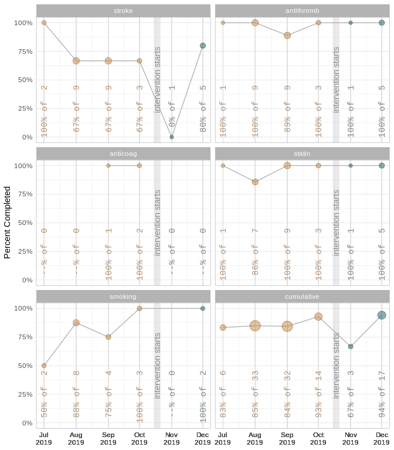

This report covers the analyses used in the ZZZ project (Marcus Mark, PI).

<!--  Set the working directory to the repository's base directory; this assumes the report is nested inside of two directories.-->


<!-- Set the report-wide options, and point to the external code file. -->


<!-- Load 'sourced' R files.  Suppress the output when loading sources. -->


<!-- Load packages, or at least verify they're available on the local machine.  Suppress the output when loading packages. -->


<!-- Load any global functions and variables declared in the R file.  Suppress the output. -->


<!-- Declare any global functions specific to a Rmd output.  Suppress the output. -->


<!-- Load the datasets.   -->


<!-- Tweak the datasets.   -->


Summary {.tabset .tabset-fade .tabset-pills}
===========================================================================

Notes
---------------------------------------------------------------------------

1. The current report covers 4 month, with 2 unique values for `month`.


Unanswered Questions
---------------------------------------------------------------------------


Answered Questions
---------------------------------------------------------------------------


Graphs
===========================================================================


Marginals
---------------------------------------------------------------------------


Scatterplots
---------------------------------------------------------------------------

<!-- -->


Models
===========================================================================

Model Exploration
---------------------------------------------------------------------------

```

Call:
lm(formula = statin_proportion ~ 1 + post, data = ds)

Residuals:
         1          2          3          4 
-1.364e-01  1.364e-01 -1.388e-17 -1.388e-17 

Coefficients:
            Estimate Std. Error t value Pr(>|t|)
(Intercept)  0.86364    0.09642   8.957   0.0122
post         0.13636    0.13636   1.000   0.4226

Residual standard error: 0.1364 on 2 degrees of freedom
Multiple R-squared:  0.3333,	Adjusted R-squared:      0 
F-statistic:     1 on 1 and 2 DF,  p-value: 0.4226
```

```

Call:
glm(formula = statin_numerator/statin_denominator ~ 1 + post, 
    family = quasipoisson, data = ds)

Deviance Residuals: 
      1        2        3        4  
-0.1509   0.1431   0.0000   0.0000  

Coefficients:
            Estimate Std. Error t value Pr(>|t|)
(Intercept)  -0.1466     0.1116  -1.313    0.320
post          0.1466     0.1524   0.962    0.438

(Dispersion parameter for quasipoisson family taken to be 0.0215311)

    Null deviance: 0.063216  on 3  degrees of freedom
Residual deviance: 0.043243  on 2  degrees of freedom
AIC: NA

Number of Fisher Scoring iterations: 4
```


Final Model
---------------------------------------------------------------------------


|            | Estimate| Std. Error| t value| Pr(>&#124;t&#124;)|
|:-----------|--------:|----------:|-------:|------------------:|
|(Intercept) |    -0.15|       0.11|   -1.31|               0.32|
|post        |     0.15|       0.15|    0.96|               0.44|

In the model that includes two predictors, the slope coefficent of `Miles per gallon` is 0.1466035.


Session Information {#session-info}
===========================================================================

For the sake of documentation and reproducibility, the current report was rendered in the following environment.  Click the line below to expand.

<details>
  <summary>Environment <span class="glyphicon glyphicon-plus-sign"></span></summary>

```
─ Session info ───────────────────────────────────────────────────────────────
 setting  value                       
 version  R version 3.6.2 (2019-12-12)
 os       Ubuntu 19.10                
 system   x86_64, linux-gnu           
 ui       X11                         
 language (EN)                        
 collate  en_US.UTF-8                 
 ctype    en_US.UTF-8                 
 tz       America/Chicago             
 date     2020-02-25                  

─ Packages ───────────────────────────────────────────────────────────────────
 package     * version date       lib source        
 assertthat    0.2.1   2019-03-21 [1] CRAN (R 3.6.2)
 backports     1.1.5   2019-10-02 [1] CRAN (R 3.6.2)
 callr         3.4.2   2020-02-12 [1] CRAN (R 3.6.2)
 cli           2.0.1   2020-01-08 [1] CRAN (R 3.6.2)
 colorspace    1.4-1   2019-03-18 [1] CRAN (R 3.6.2)
 config        0.3     2018-03-27 [1] CRAN (R 3.6.2)
 crayon        1.3.4   2017-09-16 [1] CRAN (R 3.6.2)
 desc          1.2.0   2018-05-01 [1] CRAN (R 3.6.2)
 devtools      2.2.2   2020-02-17 [1] CRAN (R 3.6.2)
 digest        0.6.25  2020-02-23 [1] CRAN (R 3.6.2)
 dplyr         0.8.4   2020-01-31 [1] CRAN (R 3.6.2)
 ellipsis      0.3.0   2019-09-20 [1] CRAN (R 3.6.2)
 evaluate      0.14    2019-05-28 [1] CRAN (R 3.6.2)
 fansi         0.4.1   2020-01-08 [1] CRAN (R 3.6.2)
 farver        2.0.3   2020-01-16 [1] CRAN (R 3.6.2)
 fs            1.3.1   2019-05-06 [1] CRAN (R 3.6.2)
 ggplot2     * 3.2.1   2019-08-10 [1] CRAN (R 3.6.2)
 glue          1.3.1   2019-03-12 [1] CRAN (R 3.6.2)
 gtable        0.3.0   2019-03-25 [1] CRAN (R 3.6.2)
 highr         0.8     2019-03-20 [1] CRAN (R 3.6.2)
 hms           0.5.3   2020-01-08 [1] CRAN (R 3.6.2)
 htmltools     0.4.0   2019-10-04 [1] CRAN (R 3.6.2)
 import        1.1.0   2015-06-22 [1] CRAN (R 3.6.2)
 knitr       * 1.28    2020-02-06 [1] CRAN (R 3.6.2)
 labeling      0.3     2014-08-23 [1] CRAN (R 3.6.2)
 lazyeval      0.2.2   2019-03-15 [1] CRAN (R 3.6.2)
 lifecycle     0.1.0   2019-08-01 [1] CRAN (R 3.6.2)
 magrittr      1.5     2014-11-22 [1] CRAN (R 3.6.2)
 memoise       1.1.0   2017-04-21 [1] CRAN (R 3.6.2)
 munsell       0.5.0   2018-06-12 [1] CRAN (R 3.6.2)
 pillar        1.4.3   2019-12-20 [1] CRAN (R 3.6.2)
 pkgbuild      1.0.6   2019-10-09 [1] CRAN (R 3.6.2)
 pkgconfig     2.0.3   2019-09-22 [1] CRAN (R 3.6.2)
 pkgload       1.0.2   2018-10-29 [1] CRAN (R 3.6.2)
 prettyunits   1.1.1   2020-01-24 [1] CRAN (R 3.6.2)
 processx      3.4.2   2020-02-09 [1] CRAN (R 3.6.2)
 ps            1.3.2   2020-02-13 [1] CRAN (R 3.6.2)
 purrr         0.3.3   2019-10-18 [1] CRAN (R 3.6.2)
 R6            2.4.1   2019-11-12 [1] CRAN (R 3.6.2)
 Rcpp          1.0.3   2019-11-08 [1] CRAN (R 3.6.2)
 readr         1.3.1   2018-12-21 [1] CRAN (R 3.6.2)
 remotes       2.1.1   2020-02-15 [1] CRAN (R 3.6.2)
 rlang         0.4.4   2020-01-28 [1] CRAN (R 3.6.2)
 rmarkdown     2.1     2020-01-20 [1] CRAN (R 3.6.2)
 rprojroot     1.3-2   2018-01-03 [1] CRAN (R 3.6.2)
 scales        1.1.0   2019-11-18 [1] CRAN (R 3.6.2)
 sessioninfo   1.1.1   2018-11-05 [1] CRAN (R 3.6.2)
 stringi       1.4.6   2020-02-17 [1] CRAN (R 3.6.2)
 stringr       1.4.0   2019-02-10 [1] CRAN (R 3.6.2)
 testthat      2.3.1   2019-12-01 [1] CRAN (R 3.6.2)
 tibble        2.1.3   2019-06-06 [1] CRAN (R 3.6.2)
 tidyselect    1.0.0   2020-01-27 [1] CRAN (R 3.6.2)
 usethis       1.5.1   2019-07-04 [1] CRAN (R 3.6.2)
 vctrs         0.2.3   2020-02-20 [1] CRAN (R 3.6.2)
 withr         2.1.2   2018-03-15 [1] CRAN (R 3.6.2)
 xfun          0.12    2020-01-13 [1] CRAN (R 3.6.2)
 yaml          2.2.1   2020-02-01 [1] CRAN (R 3.6.2)

[1] /home/wibeasley/R/x86_64-pc-linux-gnu-library/3.6
[2] /usr/local/lib/R/site-library
[3] /usr/lib/R/site-library
[4] /usr/lib/R/library
```
</details>


Report rendered by wibeasley at 2020-02-25, 01:35 -0600 in 1 seconds.
